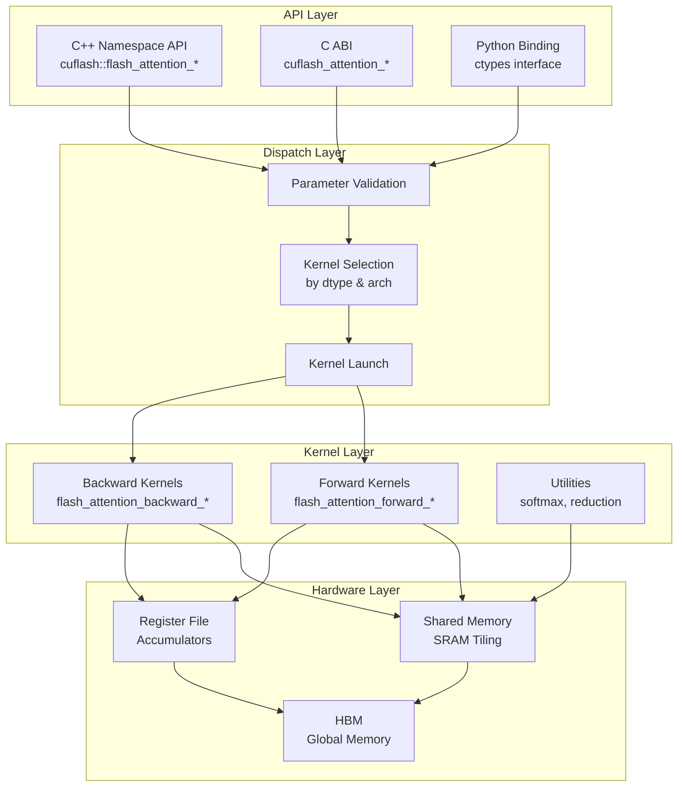
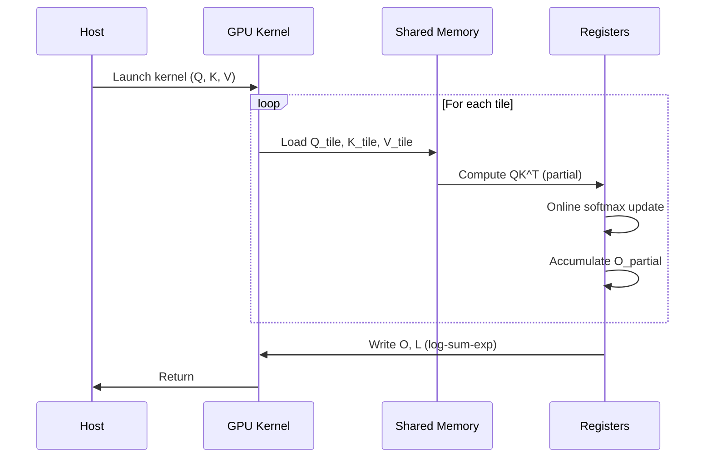
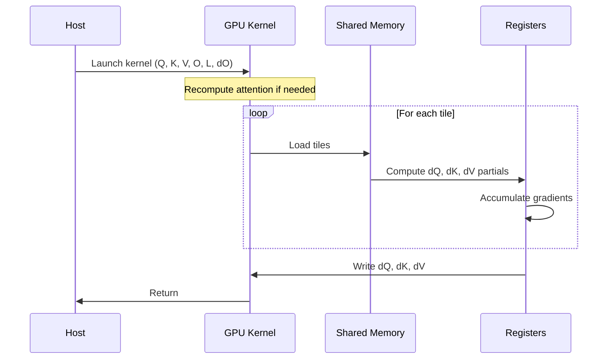
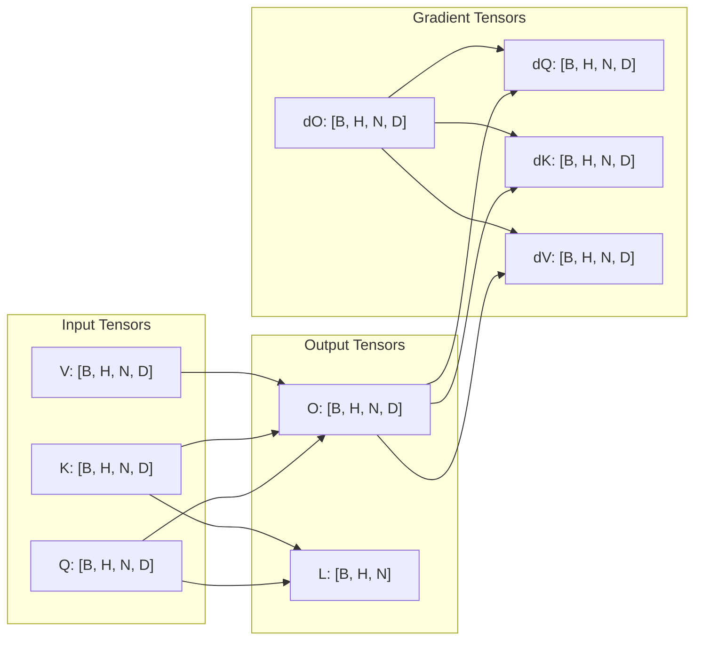
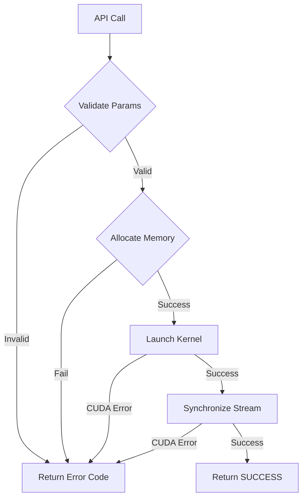

# Architecture Overview

This page provides a comprehensive architectural view of CuFlash-Attn, designed for researchers and engineers who need to understand the system design.

---

## System Architecture



---

## Data Flow

### Forward Pass



### Backward Pass



---

## Memory Layout



---

## Kernel Tiling Strategy

### Tile Dimensions

| Parameter | Description | Typical Value |
|-----------|-------------|---------------|
| `B_r` | Query tile size | 128 |
| `B_c` | Key/Value tile size | 64 |
| `D` | Head dimension | 64, 128 |
| `T_r` | Threads per query tile | 128 |

### Memory Complexity

$$
\text{SRAM} = O(B_r \times D + B_c \times D + B_r \times B_c)
$$

For typical values ($B_r=128, B_c=64, D=128$):

$$
\text{SRAM} = 128 \times 128 + 64 \times 128 + 128 \times 64 = 32\text{KB}
$$

---

## Directory Structure

```
cuflash-attn/
├── include/cuflash/          # Public API headers
│   ├── flash_attention.h     # C++ namespace API
│   └── flash_attention_c.h   # C ABI
├── src/
│   ├── api/                  # API dispatch layer
│   │   └── flash_attention_api.cu
│   ├── forward/              # Forward kernels
│   │   ├── forward_kernel_f32.cu
│   │   └── forward_kernel_f16.cu
│   ├── backward/             # Backward kernels
│   │   ├── backward_kernel_f32.cu
│   │   └── backward_kernel_f16.cu
│   └── kernels/              # Shared utilities
│       ├── softmax.cuh
│       └── memory.cuh
└── tests/
    ├── unit/                  # Unit tests
    └── integration/           # Integration tests
```

---

## Error Handling Flow



---

## Performance Characteristics

| Operation | Memory | Compute | Bandwidth Bound |
|-----------|--------|---------|-----------------|
| Forward | $O(N)$ | $O(N^2)$ | Yes (low D) |
| Backward | $O(N)$ | $O(N^2)$ | Yes (low D) |
| Recompute | $O(1)$ | $O(N^2)$ | Yes |

::: tip Key Insight
FlashAttention reduces memory from $O(N^2)$ to $O(N)$ by never materializing the full attention matrix. The trade-off is recomputing attention scores during the backward pass, which is compute-bound and thus efficient on modern GPUs.
:::
