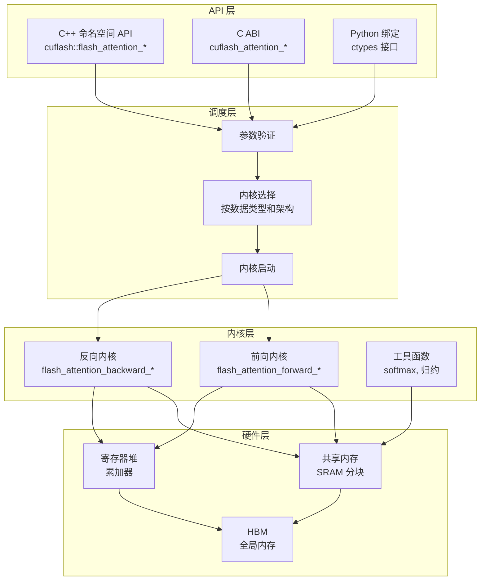
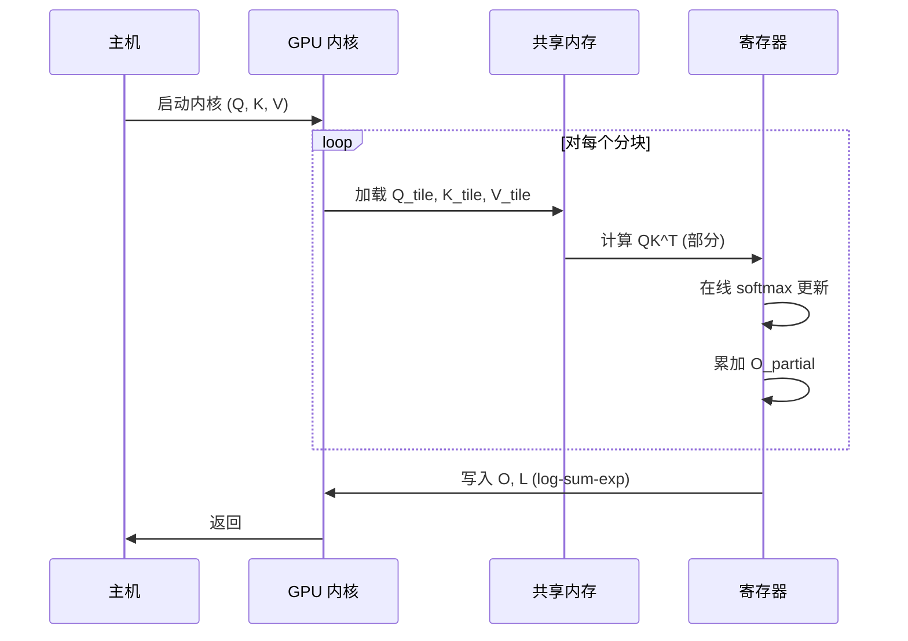
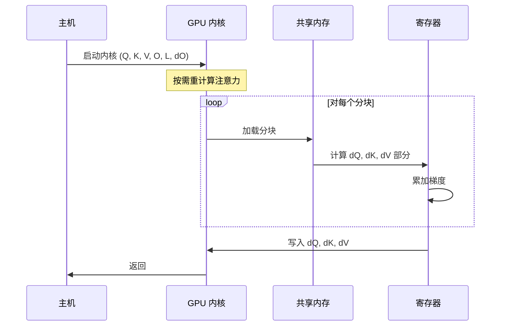
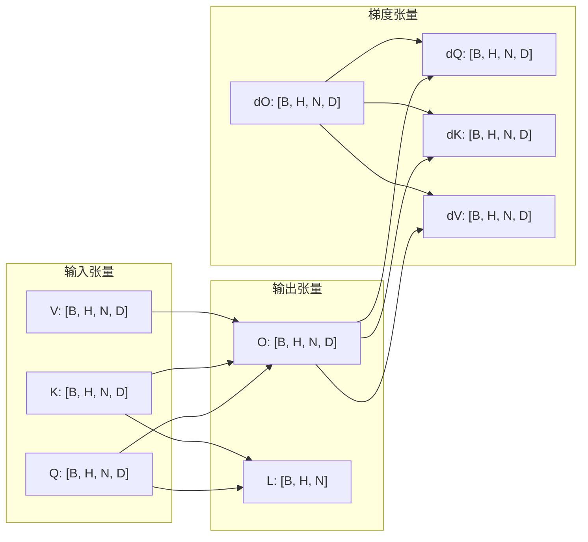
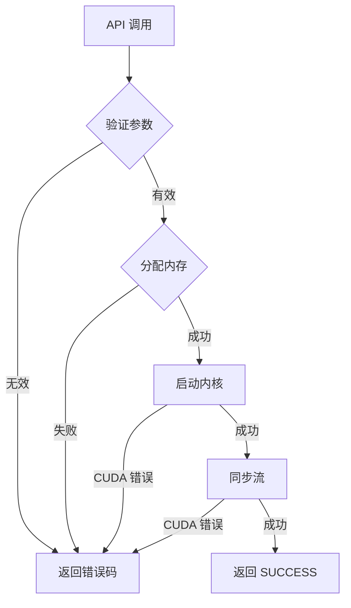

# 架构总览

本页提供 CuFlash-Attn 的全面架构视图，面向需要理解系统设计的研究人员和工程师。

---

## 系统架构



---

## 数据流

### 前向传播



### 反向传播



---

## 内存布局



---

## 内核分块策略

### 分块维度

| 参数 | 描述 | 典型值 |
|------|------|--------|
| `B_r` | Query 分块大小 | 128 |
| `B_c` | Key/Value 分块大小 | 64 |
| `D` | 头维度 | 64, 128 |
| `T_r` | 每 Query 分块线程数 | 128 |

### 内存复杂度

$$
\text{SRAM} = O(B_r \times D + B_c \times D + B_r \times B_c)
$$

对于典型值 ($B_r=128, B_c=64, D=128$)：

$$
\text{SRAM} = 128 \times 128 + 64 \times 128 + 128 \times 64 = 32\text{KB}
$$

---

## 目录结构

```
cuflash-attn/
├── include/cuflash/          # 公开 API 头文件
│   ├── flash_attention.h     # C++ 命名空间 API
│   └── flash_attention_c.h   # C ABI
├── src/
│   ├── api/                  # API 调度层
│   │   └── flash_attention_api.cu
│   ├── forward/              # 前向内核
│   │   ├── forward_kernel_f32.cu
│   │   └── forward_kernel_f16.cu
│   ├── backward/             # 反向内核
│   │   ├── backward_kernel_f32.cu
│   │   └── backward_kernel_f16.cu
│   └── kernels/              # 共享工具
│       ├── softmax.cuh
│       └── memory.cuh
└── tests/
    ├── unit/                  # 单元测试
    └── integration/           # 集成测试
```

---

## 错误处理流程



---

## 性能特征

| 操作 | 内存 | 计算 | 带宽受限 |
|------|------|------|----------|
| 前向 | $O(N)$ | $O(N^2)$ | 是 (低 D) |
| 反向 | $O(N)$ | $O(N^2)$ | 是 (低 D) |
| 重计算 | $O(1)$ | $O(N^2)$ | 是 |

::: tip 关键洞察
FlashAttention 通过永不物化完整注意力矩阵，将内存从 $O(N^2)$ 降至 $O(N)$。代价是在反向传播时重计算注意力分数，这是计算受限的操作，因此在现代 GPU 上效率很高。
:::
